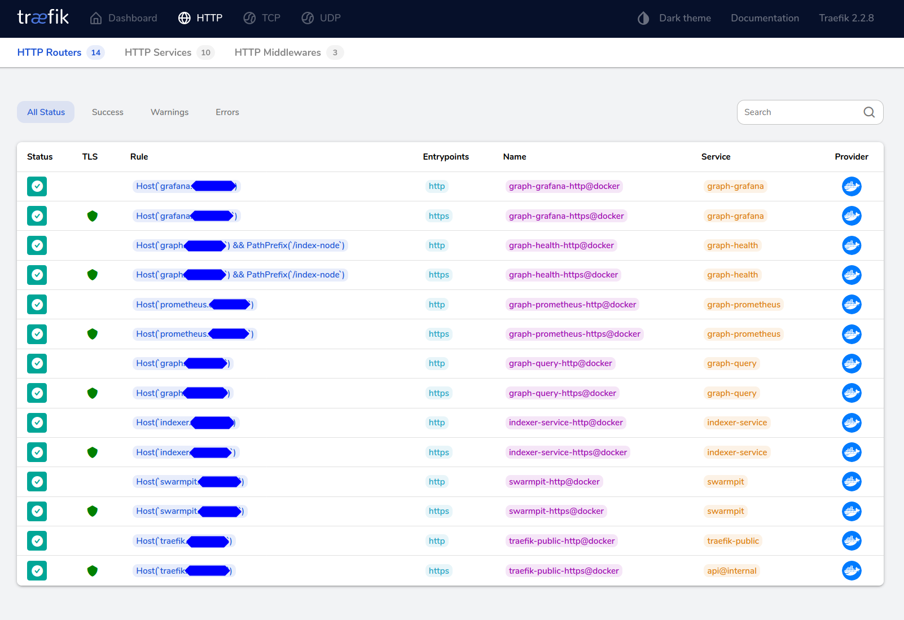
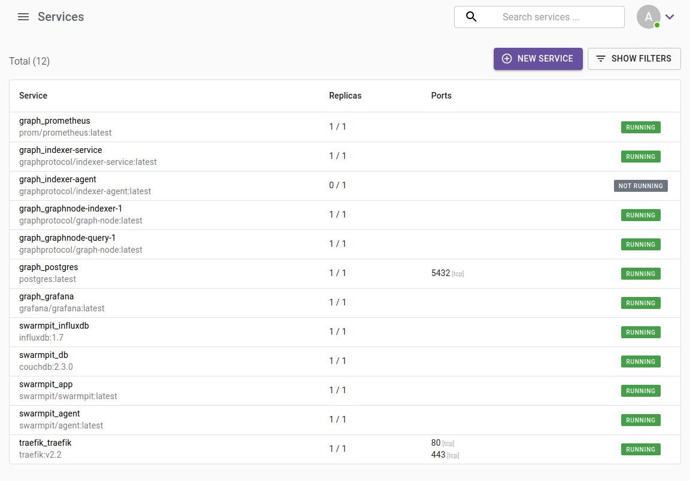
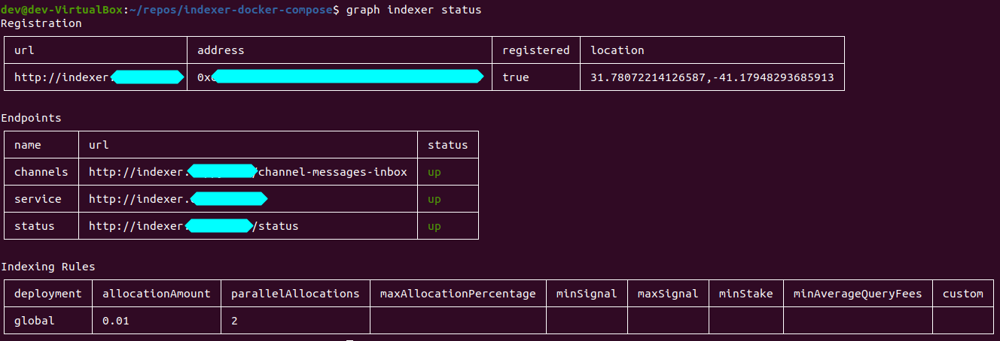

<h1>Phase 1 Mission 1 - Setting up the Indexer Stack</h1>

This tutorial is also available via my blog: https://patrickgallagher.dev/blog/2020/09/06/graph-indexer-phase1

Hello Indexers, congrats on making it to Phase 1! Now its time to add some query handling & monetization tooling with two new additions- the indexer agent and indexer service.

During Phase 0 it seemed like the hardware requirements were over-stated. Rather than continue to overpay for one large under-utilized server, I decided to downsize significantly ($20/mo compared to $160/mo), and set up Docker Swarm so I'm ready to scale up as needed. I compared performance before/after this transition, if you're interested in [seeing the results](../performance). Just be mindful that the phase 0 test harness is not good at approximating actual usage, since queries are duplicated, and thus the responses are cached.

🛸🛸🛸🛸 Lets migrate our infra to Docker Swarm! 🛸🛸🛸🛸

> Salty about having to learn something new? See [non-swarm](./non-swarm) for the vanilla docker-compose provided by @amxx (thanks!). I haven't tested it myself, so you're on your own with that one.

# Set up Swarm + Traefik



If you're like me, and never used Swarm before, then start with this tutorial https://dockerswarm.rocks/ which was adapted here for convenience. If you'd rather dive in, you can try following theses commands.

Once you're done setting up swarm, jump to the next section.

```bash
# Connect as root
ssh root@<ip>

export USE_HOSTNAME=traefik.mysite.com
echo $USE_HOSTNAME > /etc/hostname
hostname -F /etc/hostname
```

Start a new docker swarm

```bash
docker swarm init
```

If you already have additional machines ready, you can add them to the swarm now. Otherwise skip this step.
it.

```bash
docker swarm join-token worker
```

Check the cluster is running

```bash
docker node ls
```

## Add Traefik

Create an overlay network

```bash
docker network create --driver=overlay traefik-public
```

> The overlay network sits on top of (overlays) the host-specific networks and allows containers connected to it to communicate securely when encryption is enabled

Now set environment variables

```bash
export NODE_ID=$(docker info -f '{{.Swarm.NodeID}}')
docker node update --label-add traefik-public.traefik-public-certificates=true $NODE_ID
export EMAIL=patrick@somemailserver.com
export DOMAIN=traefik.mysite.com
export USERNAME=admin
export PASSWORD=changethis
# Use openssl to generate the password hash
export HASHED_PASSWORD=$(openssl passwd -apr1 $PASSWORD)
echo $HASHED_PASSWORD
# > $apr1$89eqM5Ro$CxaFELthUKV21DpI3UTQO.
```

Download a template docker-compose file for Traefik

```bash
curl -L dockerswarm.rocks/traefik.yml -o traefik.yml
# Check the contents traefik.yml
cat traefik.yml
# Deploy
docker stack deploy -c traefik.yml traefik
# Check it
docker stack ps traefik
docker service logs traefik_traefik
```

### Using Traefik

Log in to traefik.mysite.com to see the dashboard

> If you need to read the client IP in your applications/stacks using the X-Forwarded-For or X-Real-IP headers provided by Traefik, you need to make Traefik listen directly, not through Docker Swarm mode. See "Getting the client IP"

## Add Swarmpit for monitoring

I highly recommend following these instructions to set up a Swarmpit dashboard https://dockerswarm.rocks/swarmpit/



# Deploy the Indexer Stack

First pull down the repo

```bash
git clone https://github.com/pi0neerpat/indexer-docker-compose
cd indexer-docker-compose/indexer-install
```

To allow Traefik to "see" our docker containers, we need to update our docker-compose file with the labels. Docker labels don’t do anything by themselves, but Traefik reads these so it knows how to treat containers. Note that this need to be service-level labels rather than container-level (i.e. under the deploy tag).

💪 I've already done the heavy lifting for you and created `graph.yml` in this folder.

```yml
networks:
  # Network between all containers in the stack
  - default
  # Networks used to communicate with Traefik
  - traefik-public
deploy:
  labels:
    - traefik.enable=true
    - traefik.docker.network=traefik-public
    - traefik.constraint-label=traefik-public
    # A router called "graph-query-http" should accept requests from eg. graph.mysite.com
    - "traefik.http.routers.graph-query-http.rule=Host(`${GRAPH_QUERY_SERVER_DOMAIN}`)"
    # The router should accept requests via http / port 80
    - traefik.http.routers.graph-query-http.entrypoints=http
    # The router should use the middleware "https-redirect"
    - traefik.http.routers.graph-query-http.middlewares=https-redirect
    # A router called "graph-query-https"  should accept requests from eg. graph.mysite.com
    - "traefik.http.routers.graph-query-https.rule=Host(`${GRAPH_QUERY_SERVER_DOMAIN}`)"
    # The router should accept requests via https / port 443
    - traefik.http.routers.graph-query-https.entrypoints=https
    # SSL cert stuff
    - traefik.http.routers.graph-query-https.tls=true
    - traefik.http.routers.graph-query-https.tls.certresolver=le
    # A service called "graph-query" should be created using port 8000 of this docker container
    - traefik.http.services.graph-query.loadbalancer.server.port=8000
```

If you're continuing from the [phase 0 tutorial](https://github.com/pi0neerpat/indexer-docker-compose#phase-0---deploy-graph-node), you will need to update the location of the postgres volume in `graph.yml`.

```yml
postgres:
  volumes:
    - /data/postgres:/var/lib/postgresql/data
    # Change to
    - ~/subgraph-data/postgres:/var/lib/postgresql/data
```

Now specify the variables for your set up by copying `.template.env` to `.env` and editing accordingly.

Next, create a label in this node, so that the Postgres database is always deployed to the same node and uses the existing volume:

```bash
export NODE_ID=$(docker info -f '{{.Swarm.NodeID}}')
docker node update --label-add postgres.postgres-data=true $NODE_ID
```

Create some necessary directories. See [docker docs](https://docs.docker.com/engine/install/linux-postinstall/) for more help with managing permissions.

```bash
mkdir -p /data/grafana /data/prometheus /data/postgres /data/rinkeby/chaindata
sudo chown "$USER":"$USER" /data/ -R
```

Log in to docker using your credentials and pull the private images.

```bash
docker login
docker pull graphprotocol/indexer-service:latest
docker pull graphprotocol/indexer-agent:latest
```

Load the `.env` file (this command is a bit wonky, so feel free to suggest a better approach), and then deploy the indexer stack.

```bash
source .env
# OR
export $(grep -v '^#' .env | xargs -0)

docker stack deploy -c graph.yml graph
```

If you ever need to change `graph.yml` or `.env` configs, simply run these commands again. There is no need to stop the stack or services from running.

Now you should be able to access your grafana at the url you provided for `GF_SERVER_DOMAIN`. The Dashboards should already be created for you.

If you need to create fresh subgraphs, use the commands from the basic tutorial [here](../graph-node/basic).

If you're migrating from an existing set up, your subgraphs might not being syncing right away. This is likely due to a change in `node_id` the subgraphs are assigned to. Change the `node_id` using `subgraph_reassign`.

```bash
http post <indexer>:8020  \
jsonrpc="2.0"  id="1"  \
method="subgraph_reassign"  \
params:='{"name": "molochventures/moloch", "ipfs_hash": \
"QmTXzATwNfgGVukV1fX2T6xw9f6LAYRVWpsdXyRWzUR2H9", "node_id": "missioncontrol_indexer_1"}'
```

## Indexer Agent

If you check the indexer-service status, you will see that both the indexer-agent/service fail to start due to a missing database. To add it, open a terminal inside the postgres container.

```bash
docker exec -ti <container_id> bash

psql -U graph-node

CREATE DATABASE indexer;
```

Now indexer service and agent should be running. If you don't have Rinkeby ETH and GRT in your wallet, then the agent may fail to start.

# Completing Mission 1

To wrap up the Phase 1 Mission 1 challenge, we need to provide the output from our indexer-service status, as described [here](https://github.com/graphprotocol/mission-control-indexer#successful-completion).

On your local machine, set npm to use The Graph's private package registry Verdaccio (another awesome [self-hosted tool](https://verdaccio.org/)). I recommend against yarn, as it can be troublesome to set up with Verdaccio.

```bash
# On your local machine
npm set registry https://testnet.thegraph.com/npm-registry
npm login
# Use the credentials provided in the email from Eva
```

Install the CLI tools, then reset your registry back to normal.

```bash
# Install the latest
npm install -g \
  @graphprotocol/graph-cli \
  @graphprotocol/indexer-cli

npm set registry https://registry.npmjs.com/
```

Now, on your server, uncomment the network and traefik tags for the indexer-agent and deploy the stack. This will temporarily expose our indexer-agent to the world, which you should not normally do. Instead you should use ssh tunneling, since the agent is like the admin portal for your indexer. I plan to find a better solution for accessing it, I just haven't figured out a good method yet.

```yml
# Swarm
networks:
  - default
  - traefik-public
deploy:
  # NOTE: Debug use only! Agent should not be exposed publicly. Instead use the CLI via ssh tunnel
  labels:
    - traefik.enable=true
    - traefik.docker.network=traefik-public
    - traefik.constraint-label=traefik-public
    - traefik.http.routers.indexer-agent-http.service=indexer-agent
    - traefik.http.routers.indexer-agent-https.service=indexer-agent
    #...
```

Connect the indexer CLI on your local machine to the indexer-agent. Then check the status.

```bash
graph indexer connect http://agent.mysite.com
graph indexer status
```



## Update the indexer rules

This is very important, since the agent will STOP SYNCING your subgraphs unless you stake GRT. I personally would like the ability to turn off this feature using a “always sync” flag. For now though, we need to update our rules table. This will set the minimum stake needed to sync at 50 GRT, and set Moloch and Uniswap to 100 GRT stake (I guess we don’t need to worry about Synthetix for now).

```bash
graph indexer rules set global minStake 50
graph indexer rules set QmXKwSEMirgWVn41nRzkT3hpUBw29cp619Gx58XW6mPhZP allocationAmount 100
graph indexer rules set QmTXzATwNfgGVukV1fX2T6xw9f6LAYRVWpsdXyRWzUR2H9 allocationAmount 100

graph indexer rules get all --merged
```

Now that we are done, DON’T FORGET to remove the traefik tags on the index-agent and redeploy the stack. We don’t want to start a bad habit.

# Whats next?

👏👏👏 Awesome work! Hopefully you learned some good stuff today. Head back to the [indexer-docker-compose repo](https://github.com/pi0neerpat/indexer-docker-compose) to start Phase 1 Mission 2 on interacting with the Agent.

#### Additional Resources

- See an issue or have a comment? Feel free to leave an issue [here](https://github.com/pi0neerpat/indexer-docker-compose/issues).
- [Non-swarm](./non-swarm) docker-compose provided by @amxx
- [Convenience scripts](./scripts) for the entire set up provided by @pkrasam

#### Definitions

- **Indexer Agent**: A small component that comes with a small database with maybe 200 rows. It doesn't require a lot of CPU, therefore it can be run on the same machine as the graph-nodes.
- **Indexer Service**: TODO
